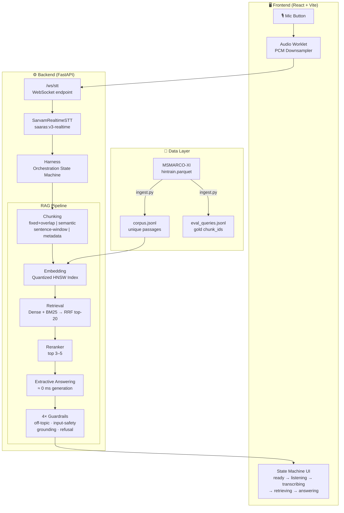
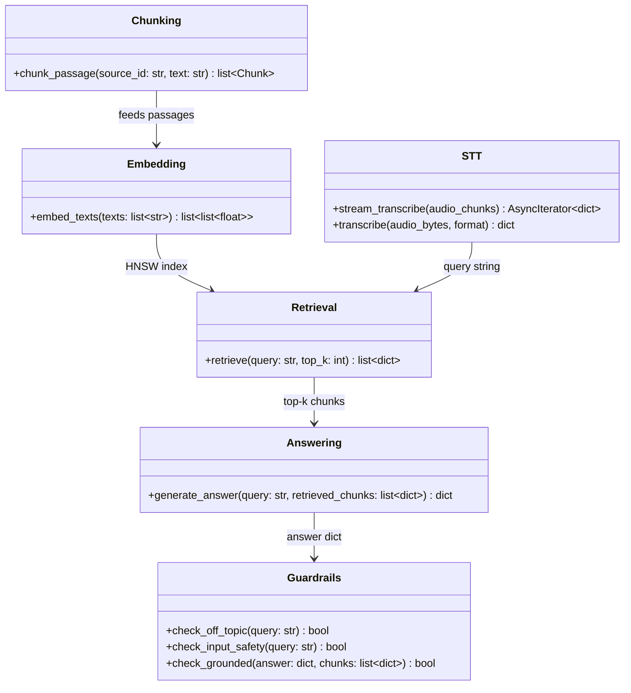
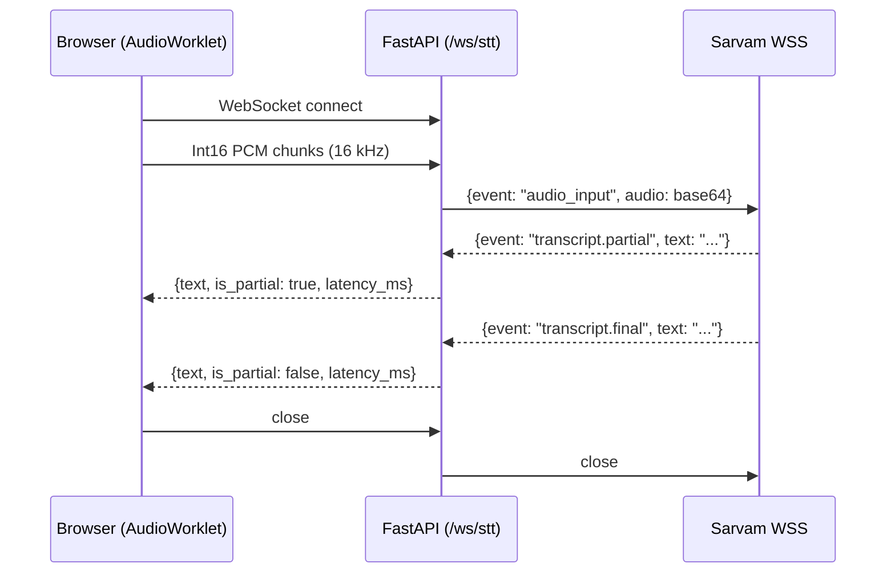
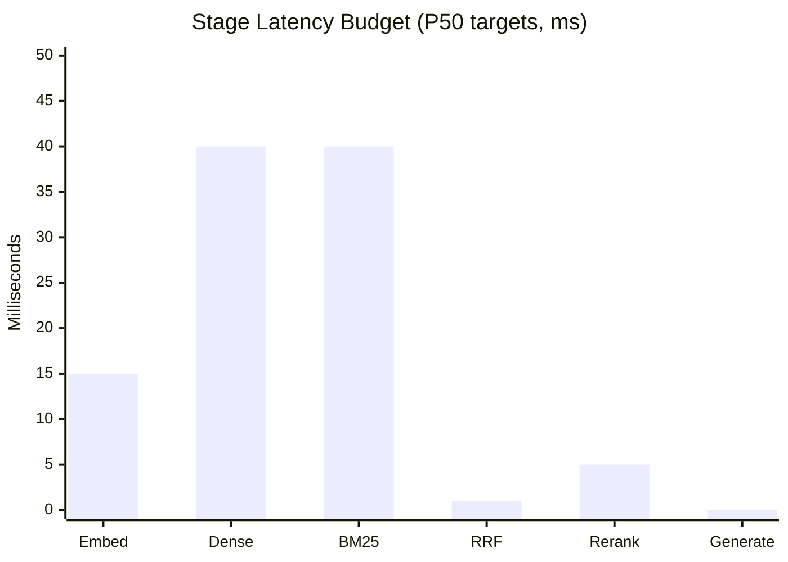
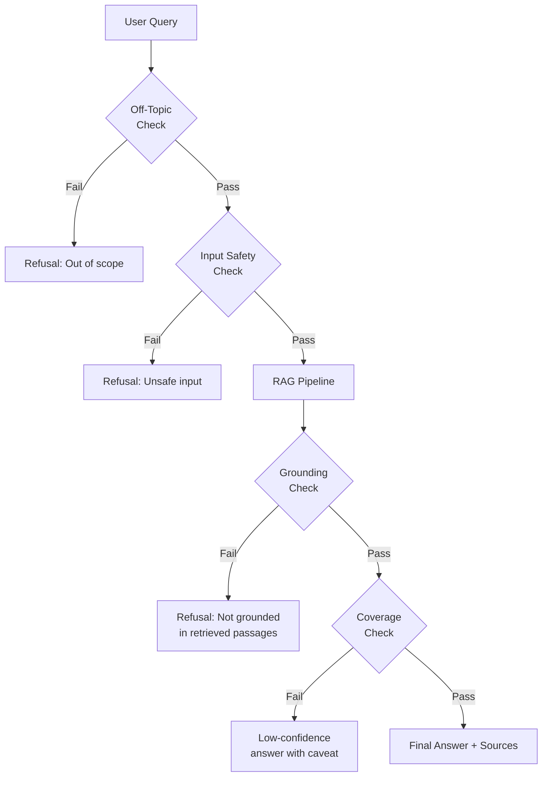
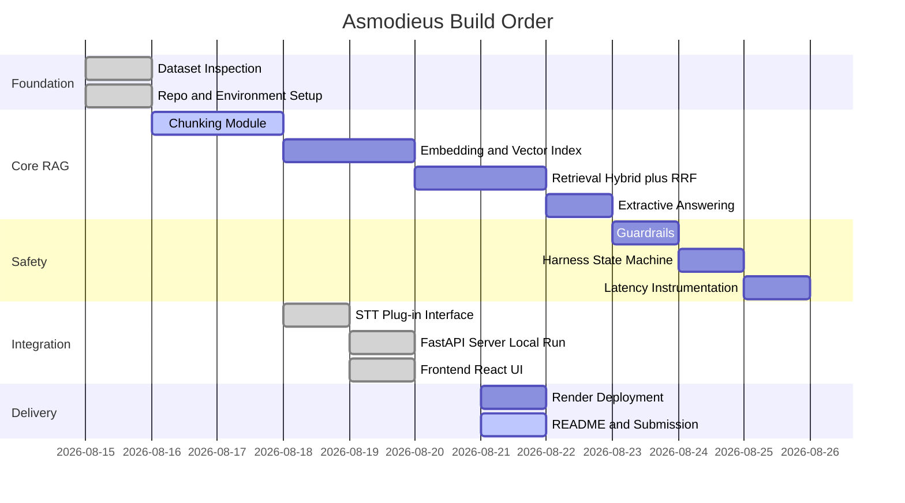

# Asmodieus

[](https://hhgoa.in)
[](https://huggingface.co/datasets/ai4bharat/MSMARCO-XI)
[](https://www.sarvam.ai)
[](https://fastapi.tiangolo.com)
[](https://vitejs.dev)

> **Speak a question. Get a grounded answer — only from indexed passages.**
>
> Voice → Sarvam STT → Hybrid Retrieve → RRF → Rerank → Extractive Answer → 4 Guardrails → Response

Asmodieus is a **voice-first Retrieval-Augmented Generation (RAG)** platform built for [HHGoa 2026](https://hhgoa.in). It ingests the MSMARCO-XI Hindi-split parquet, chunks, embeds, and indexes passages, then serves real-time voice queries through a Sarvam AI speech-to-text pipeline, hybrid dense+sparse retrieval with RRF fusion, extractive answering, and a four-stage guardrail stack — all behind a React UI.

---

## Table of Contents

- [Architecture Overview](#architecture-overview)
- [Pipeline Flow](#pipeline-flow)
- [Repository Structure](#repository-structure)
- [Module Interface Contracts](#module-interface-contracts)
- [STT: Sarvam Saaras v3](#stt-sarvam-saaras-v3)
- [Dataset & Corpus](#dataset--corpus)
- [Latency Targets](#latency-targets)
- [Guardrails](#guardrails)
- [Build Progress](#build-progress)
- [Setup & Run](#setup--run)
- [Environment Variables](#environment-variables)

---

## Architecture Overview



---

## Pipeline Flow

```mermaid
flowchart LR
    mic["🎙️ Microphone"] --> worklet["Audio Worklet\nInt16 PCM @ 16 kHz"]
    worklet -->|"WebSocket /ws/stt"| fastapi["FastAPI\nBackend"]
    fastapi --> sarvam["Sarvam Saaras v3\nReal-time STT\nwss://api.sarvam.ai"]
    sarvam -->|"TranscriptEvent\n{text, is_partial, latency_ms}"| harness["Harness\nState Machine"]
    harness --> chunk["Chunking"]
    chunk --> embed["Dense Embed\nQuantized + HNSW"]
    harness --> bm25["BM25 Sparse"]
    embed --> rrf["RRF Fusion\ntop-20"]
    bm25 --> rrf
    rrf --> rerank["Reranker\ntop 3–5"]
    rerank --> extract["Extractive Answer\nspan extraction"]
    extract --> guard["Guardrails\n4 checks"]
    guard -->|"JSON response"| ui["React UI\nAnswer + Sources"]
```



---

## Repository Structure

```text
Asmodieus/
├── data/
│   ├── raw/                    # Cached parquet (gitignored)
│   └── processed/
│       ├── corpus.jsonl        # Unique passages with chunk_id
│       └── eval_queries.jsonl  # Queries with gold chunk_id(s)
│
├── src/
│   ├── ingest.py               # Step 2.5 — subsample + dedupe + eval-set creation
│   ├── interface.py            # Shared contracts (DO NOT break signatures)
│   ├── chunking/               # Multi-strategy text chunkers
│   ├── embedding/              # Quantized embeddings + HNSW index
│   ├── retrieval/              # Hybrid dense/sparse + RRF fusion
│   ├── answering/              # Fast-path extractive span extraction
│   ├── guardrails/             # Off-topic, input-safety, grounding, refusal
│   ├── harness.py              # Core orchestration + timeout/retry/fallback
│   └── stt/
│       ├── __init__.py         # Package exports
│       ├── base.py             # STTProvider ABC + TranscriptEvent dataclass
│       ├── config.py           # Sarvam API config (loaded from .env)
│       ├── sarvam_stt.py       # SarvamRealtimeSTT + transcribe_batch
│       └── test_stt.py         # STT smoke tests
│
├── server/
│   └── main.py                 # FastAPI app — /ws/stt WebSocket endpoint
│
├── frontend/
│   ├── index.html
│   ├── vite.config.js
│   ├── package.json            # React 19 + Lucide + Vite 8
│   └── src/
│       ├── main.jsx
│       ├── App.jsx             # Full UI state machine
│       ├── index.css           # Design system (glassmorphism dark)
│       └── assets/
│
├── benchmarks/
│   └── latency.py              # P50 / P70 / P100 stage timers
│
├── inspect_data.py             # DuckDB schema dump for the parquet
├── requirements.txt
├── .gitignore
└── README.md
```

---

## Module Interface Contracts

> **⚠️ Do NOT change function signatures without notifying the full team.**



### Return Shape Reference

| Module | Returns |
|--------|---------|
| `chunk_passage` | `list[Chunk]` — with `chunk_id`, `text`, `metadata` |
| `embed_texts` | `list[list[float]]` — one vector per text |
| `retrieve` | `[{chunk_id, text, context_text, score, strategy, source_chunk_id}]` |
| `generate_answer` | `{answer, cited_chunk_ids, confidence, grounded}` |
| `stream_transcribe` | yields `{text, is_partial, language_code, latency_ms, request_id}` |

---

## STT: Sarvam Saaras v3



| Config | Value |
|--------|-------|
| **Model (Realtime)** | `saaras:v3-realtime` |
| **Model (Batch REST)** | `saaras:v3` |
| **WebSocket URL** | `wss://api.sarvam.ai/speech-to-text-realtime/ws` |
| **REST URL** | `https://api.sarvam.ai/speech-to-text` |
| **Language Code** | `auto` (auto-detect) |
| **Silence Duration** | 700 ms |
| **Min Speech Duration** | 200 ms |
| **High VAD Sensitivity** | `true` |
| **Audio Format** | Raw `Int16` PCM @ 16 kHz, mono |

---

## Dataset & Corpus

### What is MSMARCO-XI?

`ai4bharat/MSMARCO-XI` is the cross-lingual extension of MS MARCO with Hindi (`hintrain.parquet`). Each row contains:

- `Eng_Query` — the English query
- `Eng_Answer` — the gold English answer (or `"No Answer Present."`)
- `passages.English_passages` — list of 10 candidate passages
- `passages.is_selected` — binary mask for gold passage(s)

### Why we stream instead of loading the full dump

| Environment | RAM Available | Can Load Full Dump? |
|---|---|---|
| Full MSMARCO-XI dump | — | 55.6 GB needed |
| Local dev laptop | 16 GB | ❌ Process dies (RAM + 15 GB vectors) |
| Render Free | 512 MB | ❌ Embedding model alone doesn't fit |

**Solution:** DuckDB reservoir sampling — pull only the rows we need, never touch the full 55.6 GB.

### Corpus Size by Environment

| Environment | Rows Sampled | Unique Passages | Retrieval Mode |
|---|---:|---:|---|
| **Full MSMARCO-XI dump** | ~8.8 M | — | ❌ Not downloaded |
| **Local Dev** | ~10,005 | ~12,000 | Dense + BM25 + RRF + Rerank |
| **CI / Quick test** | 5,000 | ~6,000 | Dense + BM25 + RRF + Rerank |
| **Render Free (512 MB)** | N/A | N/A | BM25-only (no embedding) |

### Ingest Output Files

```text
data/processed/
├── corpus.jsonl        # {"chunk_id": "<sha1[:12]>", "text": "..."}
└── eval_queries.jsonl  # {"query_id", "query", "gold_answer",
                        #  "gold_chunk_ids", "candidate_chunk_ids",
                        #  "query_type", "has_answer"}
```

Run ingest:
```bash
python src/ingest.py --n-rows 10000
```

---

## Latency Targets

> **Assignment target: RAG pipeline < 200 ms** (STT latency excluded)

### Stage Latency Budget

| Stage | P50 target | P70 target | P100 target |
|---|---:|---:|---:|
| Embedding | ≤ 15 ms | ≤ 20 ms | ≤ 45 ms |
| Dense Retrieve | ≤ 40 ms | ≤ 50 ms | ≤ 100 ms |
| BM25 | ≤ 40 ms | ≤ 55 ms | ≤ 100 ms |
| RRF Fusion | ≤ 1 ms | ≤ 1 ms | ≤ 10 ms |
| Rerank | ≤ 5 ms | ≤ 8 ms | ≤ 20 ms |
| Generation (extractive) | ≈ 0 ms | ≈ 0 ms | ≈ 0 ms |
| **RAG Total** | **≤ 101 ms** | **≤ 134 ms** | **< 200 ms** ✅ |



Benchmarks are measured by `benchmarks/latency.py` tracking P50/P70/P100 per stage across N queries after warmup.

---

## Guardrails

Four sequential checks fire before any answer is returned:



| # | Guardrail | Function | Triggers on |
|---|---|---|---|
| 1 | **Off-Topic** | `check_off_topic(query)` | Weather, jokes, cricket scores, harmful intent |
| 2 | **Input Safety** | `check_input_safety(query)` | Prompt injection, bomb-making, PII exfiltration |
| 3 | **Grounding** | `check_grounded(answer, chunks)` | Answer text not found in any retrieved passage |
| 4 | **Coverage** | Internal confidence threshold | Low `confidence` score from `generate_answer` |

Target adversarial refusal rate: **1.0** (all 4 adversarial classes refused).

---

## Build Progress



## Setup & Run

### Prerequisites

- Python 3.10+
- Node.js 20+
- Sarvam AI API key → `SARVAM_API_KEY`
- MSMARCO-XI `hintrain.parquet` downloaded locally

### Backend

```bash
# 1. Install Python dependencies
pip install -r requirements.txt

# 2. Create .env file
echo "SARVAM_API_KEY=your_key_here" > .env

# 3. Ingest dataset (update DEFAULT_PARQUET_PATH in src/ingest.py first)
python src/ingest.py --n-rows 10000

# 4. Start FastAPI server
uvicorn server.main:app --reload --port 8000
```

### Frontend

```bash
cd frontend
npm install
npm run dev       # → http://localhost:5173
```

The React app connects to `ws://localhost:8000/ws/stt` automatically.

### Inspect Raw Data Schema

```bash
python inspect_data.py
```

---

## Environment Variables

| Variable | Required | Description |
|---|---|---|
| `SARVAM_API_KEY` | ✅ Yes | Sarvam AI subscription key for STT |

---

## Tech Stack

| Layer | Technology |
|---|---|
| **Frontend** | React 19, Vite 8, Lucide-React, Vanilla CSS (glassmorphism dark theme) |
| **Backend** | FastAPI, Uvicorn, asyncio |
| **STT** | Sarvam AI `saaras:v3-realtime` (WebSocket), `saaras:v3` (REST batch) |
| **Dataset** | `ai4bharat/MSMARCO-XI` — Hindi split (streamed via DuckDB) |
| **Retrieval** | Dense HNSW + BM25 sparse → RRF fusion → Cross-encoder rerank |
| **Answering** | Extractive span extraction (0 ms generation budget) |
| **Guardrails** | 4-stage: off-topic · input-safety · grounding · coverage |
| **Benchmarking** | Custom P50/P70/P100 per-stage timer harness |

---

<p align="center">
  Built for <strong>#HHGoa 2026</strong> · Deadline: 22 Aug 2026
</p>
